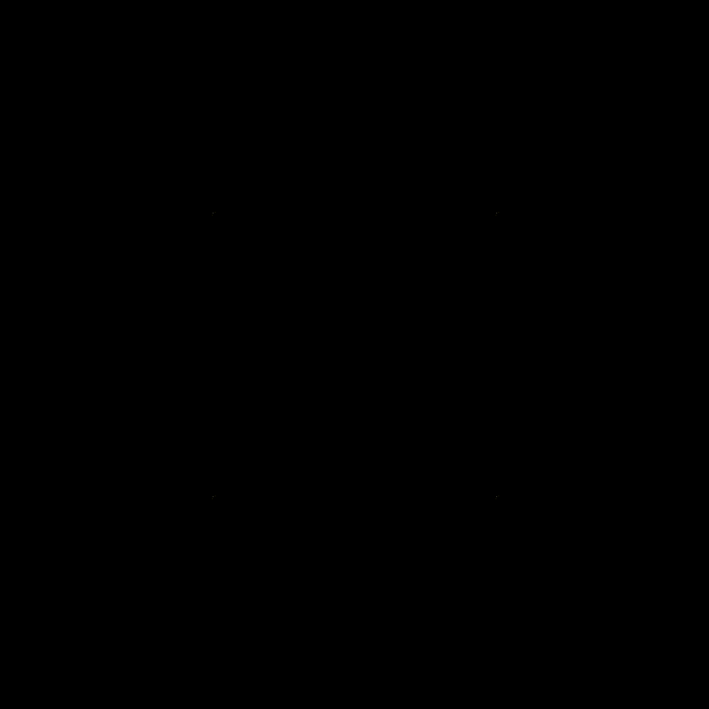

# Perlin Art

Explore Perlin noise with simple art! Visualize how lines following perlin noise appear much more fluid
and can create interesting patterns


## Examples
```python
pshapes = grid(n=3, margin=200, shape="circle")
```


```python
pshapes = grid(rows=3, columns=5, margin=250, xbounds=150, ybounds=50)
pshapes = [*pshapes, *grid(rows=5, columns=3, margin=250, xbounds=50, ybounds=150)]
```

